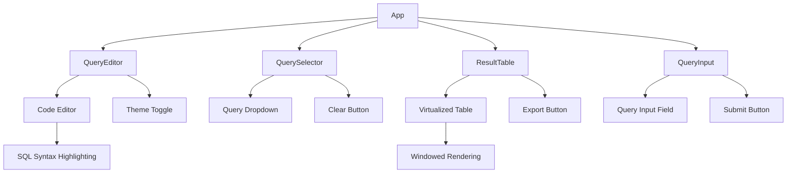
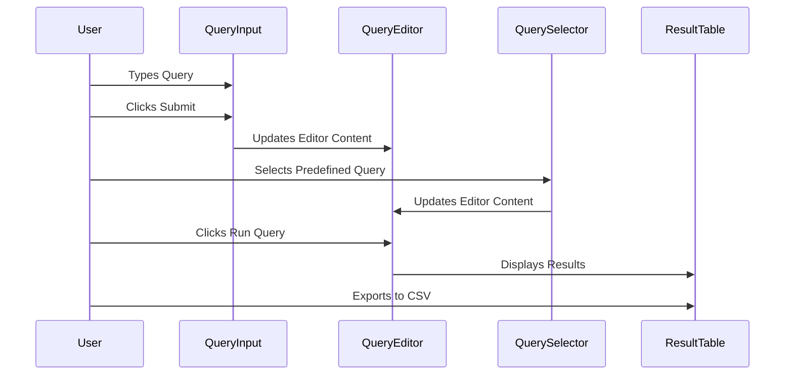
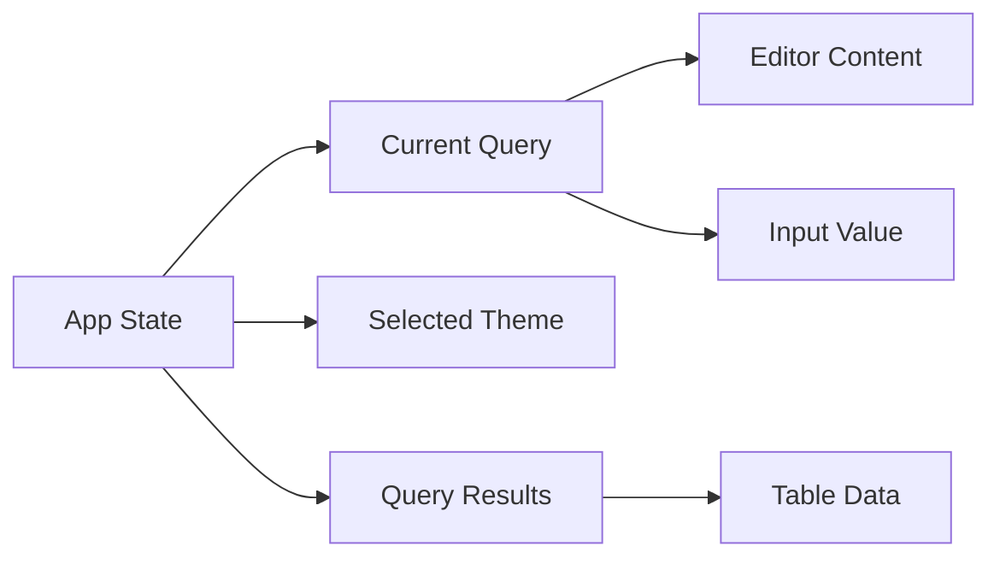
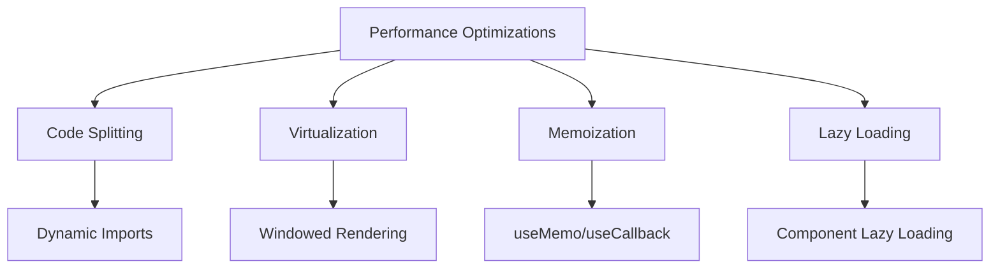
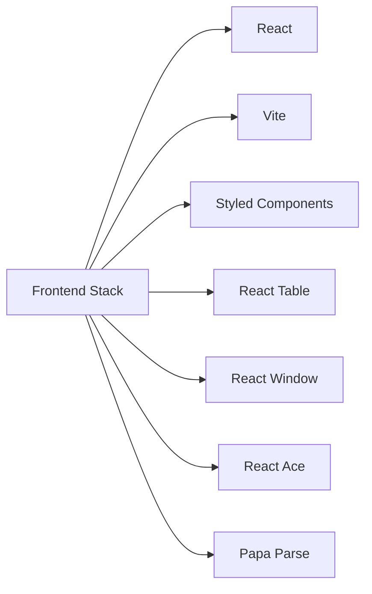

# Application Architecture

## Component Structure

## Data Flow

## Component Responsibilities

### App Component
- Main container component
- Manages application state
- Coordinates between child components
- Handles theme switching

### QueryEditor Component
- Provides SQL code editor interface
- Manages query input
- Handles syntax highlighting
- Supports theme switching

### QuerySelector Component
- Manages predefined queries
- Handles query selection
- Provides clear functionality
- Updates editor content

### ResultTable Component
- Displays query results
- Implements virtualized rendering
- Handles large datasets
- Provides export functionality

### QueryInput Component
- Provides text input for queries
- Handles query submission
- Updates editor content
- Manages input state

## State Management

## Performance Optimizations

## Technology Stack

